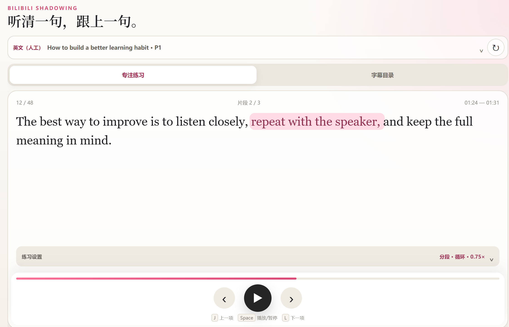

# Shadowing Studio 哔哩哔哩英语跟读扩展

一个在哔哩哔哩英文 CC 字幕基础上进行逐句、分段和循环练习的非官方浏览器扩展。

## 功能

- 读取普通哔哩哔哩 BV 视频的英文 CC 字幕。
- 支持整句或分段练习，以及单句、连播和循环播放。
- 支持 `J`、`Space`、`L` 快捷控制和多档播放速度。
- 可将字幕导出为 SRT、TXT、Markdown 或 JSON。
- 无广告、无遥测，字幕在浏览器本地处理。

## 安装

1. 从 GitHub Releases 下载 `shadowing-studio-bilibili-v0.1.0.zip`。
2. 解压到一个固定文件夹。
3. 打开 `chrome://extensions` 或 `edge://extensions`。
4. 开启“开发者模式”，点击“加载已解压的扩展程序”。
5. 选择内部直接包含 `manifest.json` 的解压文件夹。
6. 打开或刷新一个带英文 CC 的普通 BV 视频，再点击扩展图标。

请使用 Release 中提供的安装 ZIP，不要使用 GitHub 自动生成的 Source code 压缩包。

## 兼容范围

- Chrome 114 及以上版本，以及兼容 Manifest V3 的 Chromium 浏览器。
- 仅支持普通 `https://www.bilibili.com/video/BV...` 视频页面。
- 不支持番剧、直播、课程、互动视频、短链接、硬字幕或语音识别。

## 隐私

扩展不会将字幕或使用数据发送给作者或分析服务。详细说明见 [PRIVACY.md](PRIVACY.md)。

## English

Shadowing Studio is an unofficial browser extension for practising English with existing Bilibili CC subtitles. It supports sentence or segment practice, focused playback controls, multiple speeds, and local subtitle export.

Download `shadowing-studio-bilibili-v0.1.0.zip` from GitHub Releases, extract it, enable Developer mode at `chrome://extensions` or `edge://extensions`, choose **Load unpacked**, and select the folder containing `manifest.json`.

The extension supports regular Bilibili BV video pages only. Subtitle and usage data are not sent to the author or analytics services. See [PRIVACY.md](PRIVACY.md) for details.

## 非官方声明

本项目是独立制作的非官方学习工具，与哔哩哔哩及其关联公司没有隶属、授权、赞助或背书关系。“哔哩哔哩”和“bilibili”及相关标识归其权利人所有。本项目不提供视频内容，也不会绕过付费、登录或访问控制。

This project is independent and unofficial. It is not affiliated with, authorized, sponsored or endorsed by Bilibili or its affiliates. Related names and marks belong to their respective owners.

## 许可证

[MIT](LICENSE)
